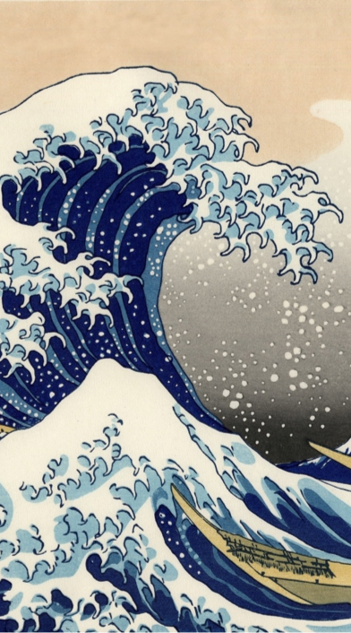
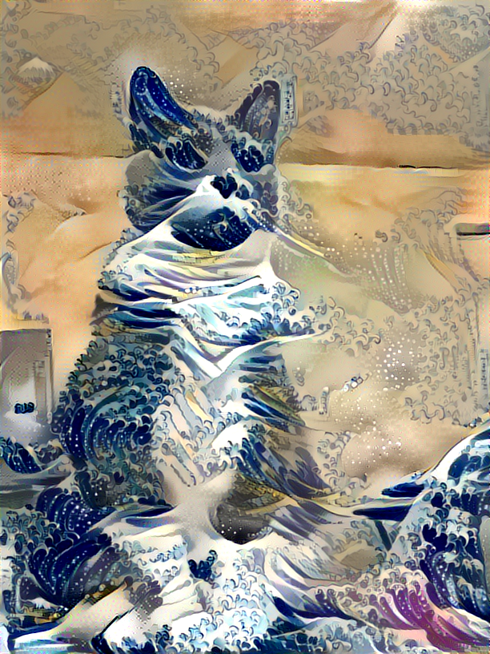

# Art Style Transfer

- This repository contains implementations of art style transfer algorithms in recent papers.
- The source code in the repository can be used to demostrate the algorithms as well as test on your own data.

## Requirements
- Python 3.3+
- [Tensorflow 1.3](https://www.tensorflow.org/)
- [TensorCV](https://github.com/conan7882/DeepVision-tensorflow) 

## Algorithms 

- [Neural Style](https://github.com/conan7882/art_style_transfer_TensorFlow/tree/master/nerual_style#neural-style) (2015)

## Neural Style

- This algorithm combines two images (content and style image) by using content and style features extracted from a pre-trained CNN (ex. VGG).
- The stylized image is generated by minimizing the difference of content and style features between a random noise image and input images. 
- Details of the implementation and more results can be find [here](https://github.com/conan7882/art_style_transfer_TensorFlow/tree/master/nerual_style). Some results:

