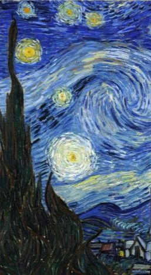
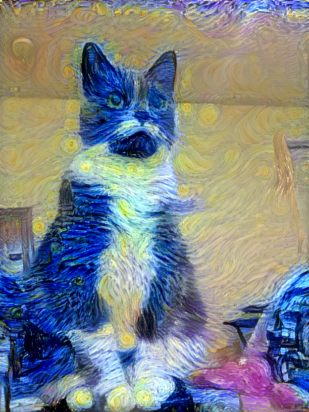
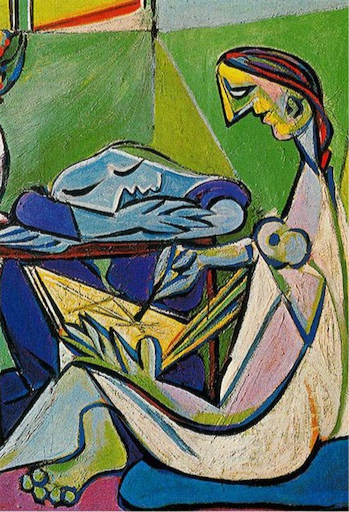
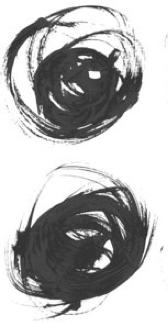
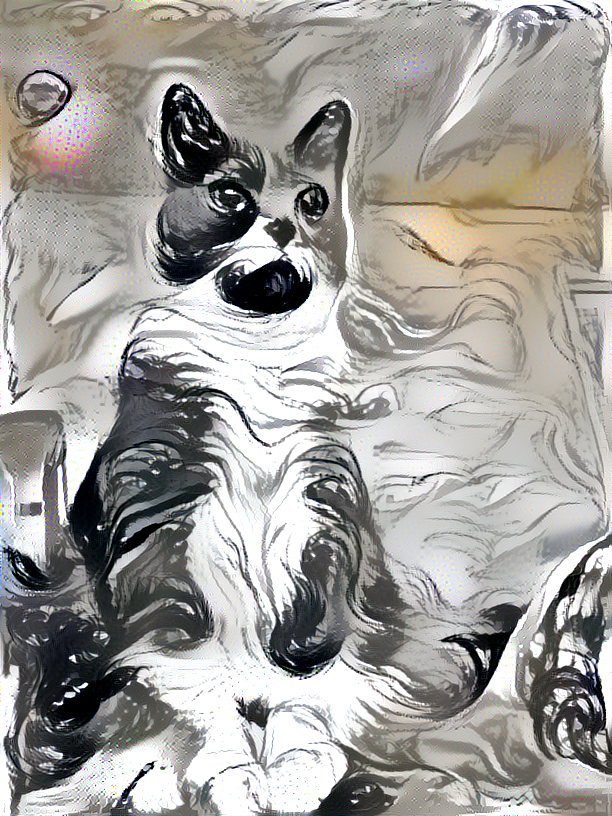
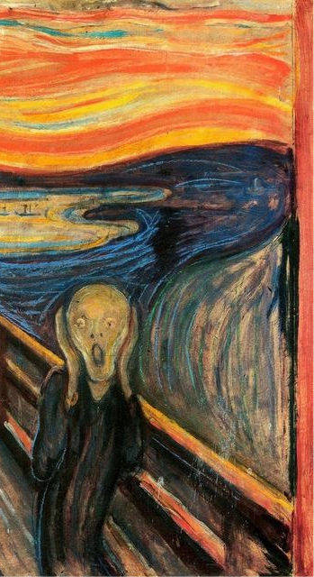
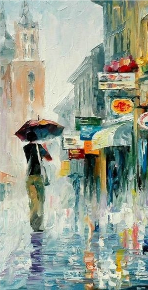
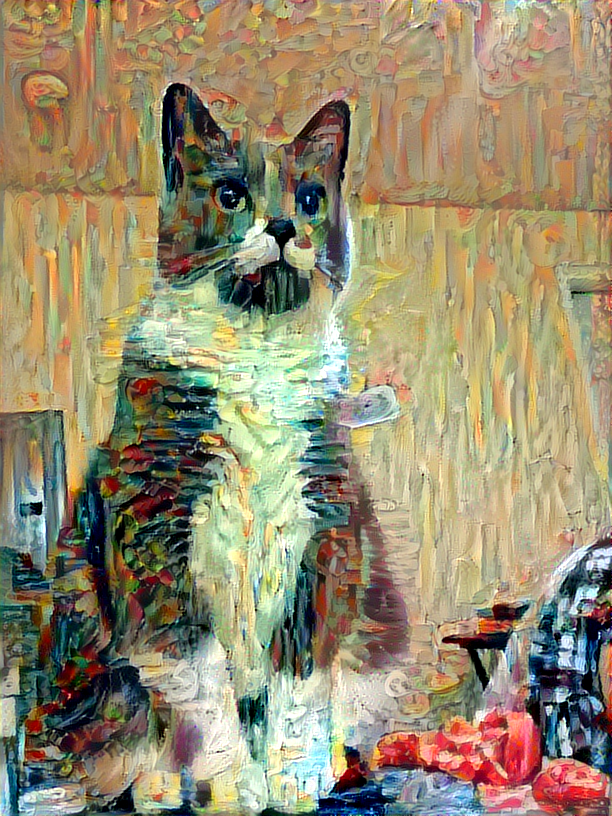

# Neural Style

- TensorFlow implementation of [A Neural Algorithm of Artistic Style](https://arxiv.org/abs/1508.06576) (2015).
- This paper combine the content and style of two different images by using image features extracted from pre-trained CNN (for image classification task).
- The style transfer process proposed in this paper is a optimization process, which minimizes the difference of content and style features between a random noise image and input context and style images.

## Requirements
- Python 3.3+
- [Tensorflow 1.3](https://www.tensorflow.org/)
- [TensorCV](https://github.com/conan7882/DeepVision-tensorflow) 

## Implementation Details

- VGG19 is used the same as the paper. Content Layer is conv4_2 and style layers are conv1_1, conv2_1, conv3_1, conv4_1 and conv5_1.
- Both content and style features is normalized based on the size of content and style images, which is inpired by [this implementation](https://github.com/anishathalye/neural-style). Because I found this is useful especially when the two images have large difference in size.
- The image is initialized by the content image. This helps to converge to good result faster. 
- The weights of content and style costs used in this implementation are 5e-4 and 0.2, respectively. Tweaking is needed when other types of normalization and initialization are used. Usually higher content cost weight if initialization from random noise.
- [Total variation regularization](https://en.wikipedia.org/wiki/Total_variation_denoising) is used to reduce noise in the result image. The weight 0.01 is used.
- [L-BFGS](https://en.wikipedia.org/wiki/Limited-memory_BFGS) is used for optimization. The maximum iteration is set to be 500, though the result does not change after 200 iterations. 

## TODO

- [x] Style transfer initialized by content image
- [ ] Tweaking hyperparameters for random initialization
- [ ] Color preserve
- [ ] Mask transfer
- [ ] Multiple styles


## Result
<p align = 'center'>

</p>
<p align = 'center'>
<a href = 'fig/vangohg.jpg'></a>

<a href = 'fig/chong.jpg'></a>

<a href = 'fig/la_muse.jpg'></a>

<a href = 'fig/mo.jpg'></a>

<a href = 'fig/the_scream.jpg'></a>

<a href = 'fig/oil.jpg'></a>

</p>

<!--## Tweaking parameters-->

## Preparation

1. Setup directories in file *CNN-Visualization/guidedbackpro.py*. 
    - *`STYLE_PATH`* - directory of style image
    - *`CONTENT_PATH`* - directory of content image
    - *`VGG_PATH`* - directory of pre-trained VGG19 parameters
    - *`SAVE_DIR`* - directory of saving result images
   
2. Download the pre-trained VGG parameters
    - Download pre-trained VGG19 model [here](https://github.com/machrisaa/tensorflow-vgg#tensorflow-vgg16-and-vgg19) and put it in *`VGG_PATH`*.


## Run Script:

Put style and content images in *`STYLE_PATH`* and  *`CONTENT_PATH`*, just run:

```
python main.py --style STYLE_IM_FILE --content CONTENT_IM_FILE --wstyle STYLE_WEIGHT \
--wcontent CONTENT_WEIGHT --wvariation TOTAL_VARIATION_WEIGHT
```	

- Add ``` --rescale``` to re-scale style image to the size comparable to content image if style image is larger than content image.
- Use ``` --cscale SIDE``` to re-scale the content image with largest side = SIDE.
-  Result will be saved in *`SAVE_DIR`* every 20 iteraton.


